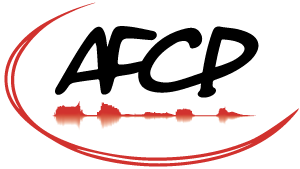
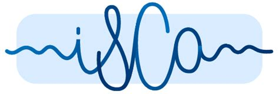

  <a href="index.html" style="float: left; display: block; color: black; text-align: center; padding: 14px 16px; text-decoration: none;">Overview</a>
  <a href="using.html" style="float: left; display: block; color: black; text-align: center; padding: 14px 16px; text-decoration: none;">Use C-LARA</a>
  <a href="examples.html" style="float: left; display: block; color: black; text-align: center; padding: 14px 16px; text-decoration: none;">Example content</a>
  <a href="ongoing_activities.html" style="float: left; display: block; color: black; text-align: center; padding: 14px 16px; text-decoration: none;">Ongoing Activities</a>
  <a href="collaborators.html" style="float: left; display: block; color: black; text-align: center; padding: 14px 16px; text-decoration: none;">Contributors</a>
  <a href="documents.html" style="float: left; display: block; color: black; text-align: center; padding: 14px 16px; text-decoration: none;">Documents</a>
  <a href="performance.html" style="float: left; display: block; color: black; text-align: center; padding: 14px 16px; text-decoration: none;">Technical issues</a>
  <a href="blog.html" style="float: left; display: block; color: black; text-align: center; padding: 14px 16px; text-decoration: none;">Blog and Discord</a>
  <a href="contact.html" style="float: left; display: block; color: black; text-align: center; padding: 14px 16px; text-decoration: none;">Contact</a>
  <a href="flinders_2024_workshop.html" style="float: left; display: block; color: black; text-align: center; padding: 14px 16px; text-decoration: none;">Upcoming workshop</a>

# Innovative approaches to speech and language technologies for Oceania, the world's most linguistically diverse region

[**Flinders University, Bedford Park campus, Adelaide, Australia**](https://www.flinders.edu.au/campus/bedford-park)

and

online (details to follow)

**25-26 July 2024**

## Participation and Registration

Everyone is welcome: people interested in languages and technology, educators, students, community members...

Attendance at the workshop is **free**.

People wishing to participate **in person** (in Adelaide) are asked to **[register](https://url.au.m.mimecastprotect.com/s/zc74Cp81QXtnxVNqBfP5UFU?domain=trybooking.com) no later than July 18** to help us to plan catering.

Connection information for people wishing to participate **online** will be posted shortly. Please check back soon. 

## Program

The program is posted <a href="flinders_2024_workshop_program.html">here</a>.

Abstracts are posted <a href="workshop-abstracts.pdf">here</a>.

## Content
Long gone are the days of learning languages by memorizing stock phrases (My tailor is rich!) and lists of verb conjugations – at least for some languages. What has historically been called Computer-assisted language learning or CALL is now very much the norm rather than the exception. We routinely use online platforms and apps (e.g. Babbel and DuoLinguo), and learners of languages rich in resources like English and French have easy access to native speaker pronunciations. But the vast majority of the world’s approximately 7000 languages are “under-resourced” – lacking in speech and language technologies such as online dictionaries, courseware (didacticiels), text-to-speech synthesis, multimedia e-books, and smartphone apps. Nowhere is this truer than in Oceania (including the Pacific islands, Australia, and New Zealand), the most linguistically diverse region in the world, home to less than 1% of the world’s people, but 11% of its languages.

Languages technologies can be important tools in promoting language use, in revitalizing endangered or vulnerable languages, and in lending social prestige, particularly among young people. They are also essential in the development of adaptive technology – for example, of screen readers and adaptive and augmented communication (AAC) devices that allow people who are blind or non-verbal to participate more fully in their communities.
There is a vibrant network of linguists, computer scientists, language teachers, and community members working to develop speech and language technologies for under-resourced languages. These technologies, however, are under-represented for the languages of Oceania, and many reseachers and developers have been working more or less independently. This is particularly true in Melanesia ; Australian linguists, community members, and educators have a more established network.

The workshop is supported by a grant from the France-Australia Science and Innovation program; Flinders University; the University of South Australia; Aix Marseille Université, CNRS, Laboratoire Parole et Langage; and Université de la Nouvelle Calédonie. It aims to bring together France/New Caledonia- and Australia-based researchers, others working on languages of the region, as well as educators, and community members. It will offer an opportunity to present and learn about ongoing research and development of resources and to discuss the potential and challenges of such technologies in the context of indigenous languages. For some participants, it will be an introduction to the greater community of researchers working on under-resourced languages and to the various resources available. For example, for some aspects it is not necessary to “reinvent the wheel”, since existing open-source code can be adapted and reused (but only if one knows it exists!). We hope that the workshop will be a step toward building a critical mass of researchers working on allied topics. We expect that it will serve as a springboard for continued discussions and collaborations.

By “innovative approaches”, we mean not only technological advances, for example, in AI and corpus phonetics, but also emerging best practices to involve communities and to design resources that are both usable and used, intuitive for non-specialists, and respectful of the speaker communities and their cultures.

## Organising committee

Belinda Chiera, University of South Australia (Adelaide, Australia)

Christèle Maizonniaux, Flinders University (Adelaide, Australia)

Manny Rayner, University of South Australia (Adelaide, Australia)

Pauline Welby, Aix Marseille University, CNRS, Laboratoire Parole et Langage (France) and Université de la Nouvelle Calédonie

## Grants

Students and early stage researchers can apply for grants to support participation through the [International Speech Communication Association](https://www.isca-speech.org/grants) and the [Association Francophone de la Communication Parlée](https://www.afcp-parole.org/informations-sur-les-bourses-de-lafcp/).

The workshop is supported by a grant from the France-Australia Science and Innovation program; Flinders University; the University of South Australia; Aix Marseille Université, CNRS, Laboratoire Parole et Langage; and Université de la Nouvelle Calédonie. It is endorsed by the International Speech Communication Association and the Association Francophone de la Communication Parlée. 

## Contact information

Please address enquiries about the workshop to langtech2024@protonmail.com.

